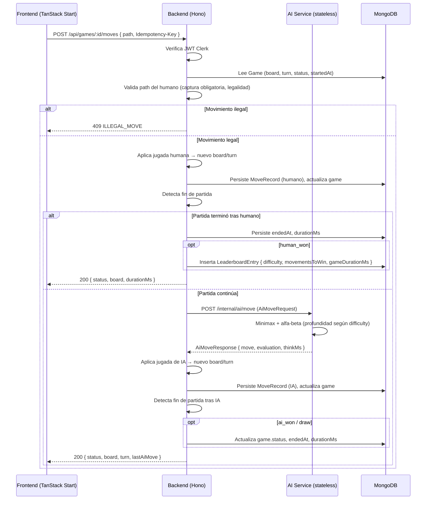
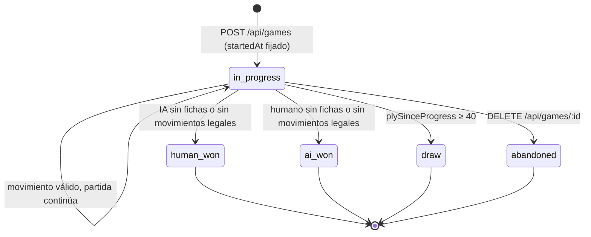
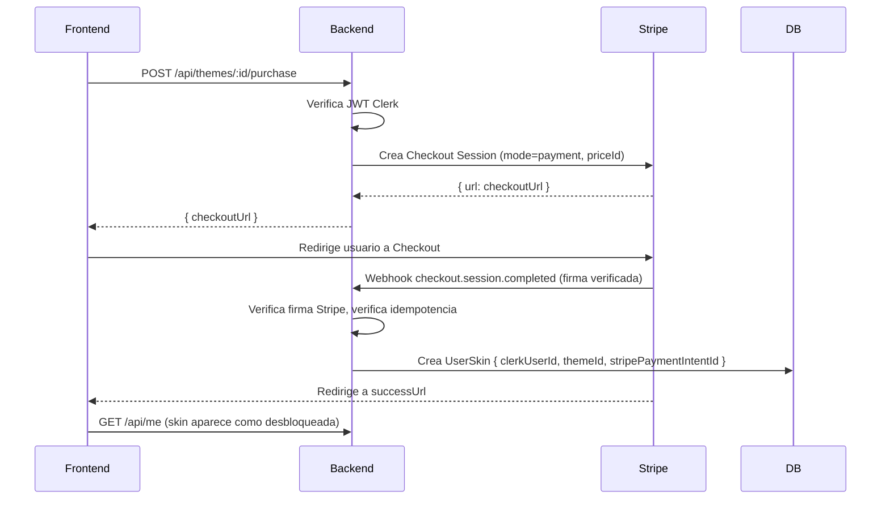

# PRD — Damas PvE v2.2

> **Estado:** Definitivo (v2.2) — todas las preguntas abiertas (Q-01..Q-09) cerradas.
> **Propósito:** guía absoluta y autocontenida para cualquier agente (humano o LLM) que implemente el proyecto.
> **Metodología:** Spec-Driven / Agentic-Oriented Development.
> **Cambios vs v2.1:** stack frontend restaurado a TanStack Start; marketplace confirmado como storefront single-seller; todas las dificultades free-to-play (easy/medium/hard); leaderboard segmentado por dificultad con desempate por tiempo de partida; análisis post-partida diferido a v3. Se añaden en v2.2: KPIs, observabilidad, disaster recovery, riesgos y ADRs.

---

## 1. Visión general

**Damas PvE** es una aplicación web donde un usuario autenticado juega Damas (Checkers) en un tablero 8×8 contra un motor de inteligencia artificial con tres niveles de dificultad: `easy`, `medium`, `hard`. Todas las dificultades son **free-to-play**.

El sistema es **autoritativo en el servidor**: el frontend solo renderiza el tablero y envía la *intención* de movimiento; toda la legalidad de las jugadas, la ejecución de capturas, la respuesta de la IA y la detección de fin de partida se calculan en el backend. Esto garantiza que las estadísticas del leaderboard sean confiables.

La monetización es un **marketplace storefront single-seller** (Stripe Checkout en modo `payment`): la app vende sus propias skins (de fichas y de tableros) de manera persistente. Las skins son **exclusivamente cosméticas**.

**Diferenciador de producto:** el ranking premia la **eficiencia** (ganar con la menor cantidad de movimientos). El leaderboard está **segmentado por dificultad** (un ranking independiente por nivel) y el desempate ante igual número de movimientos es por **tiempo de partida** (menor es mejor).

**Para quién:** jugadores de Damas casuales y competitivos que quieren medirse contra una IA, personalizar su experiencia visual y aparecer en un leaderboard objetivo.

**Decisión sobre usuarios anónimos:** el MVP **no incluye anonimato**. Todas las partidas requieren registro vía Clerk. Razones: simplificar la lógica de leaderboard y reducir complejidad de autenticación dual. Se reintroducirá en v3 si las métricas de conversión lo justifican.

---

## 2. Stack tecnológico (definitivo)

| Capa | Tecnología | Notas |
|------|-----------|-------|
| Runtime | **Bun** | Runtime único para backend y AI Service |
| Backend HTTP | **Hono** | API REST, validación, orquestación de turnos |
| Lenguaje | **TypeScript estricto** | `"strict": true`, sin `any` implícito |
| Base de datos | **MongoDB** | Driver oficial de Node compatible con Bun |
| Frontend | **TanStack Start** | Restaurado al stack original (ADR-002) |
| Autenticación | **Clerk** | Obligatoria para jugar y para aparecer en el leaderboard |
| Pagos | **Stripe Checkout** (modo `payment`) | Storefront single-seller; webhooks como fuente de verdad |
| IA | **Microservicio stateless (Bun + Hono)** | Un único endpoint; sin acceso a BD. Algoritmo: Minimax + poda alfa-beta |
| Tests | **Vitest** (backend y AI) + **React Testing Library** (frontend) + **Playwright** (E2E) | |
| Contenedores | **Docker + Docker Compose** | Orquesta: `frontend`, `backend`, `ai-service`, `mongodb` |
| Logs | **Pino** | JSON estructurado, stdout, compatible con Loki/Datadog |
| Métricas | **Prometheus** (opcional en MVP) | Exportados desde cada servicio |

---

## 3. Requisitos funcionales (RF-01..RF-37)

### Autenticación y cuentas

- **RF-01.** El usuario debe registrarse e iniciar sesión mediante Clerk. Sin sesión válida, ninguna ruta de juego ni de compra es accesible.
- **RF-02.** El `clerkUserId` es la identidad canónica que vincula al usuario con sus partidas, compras y entradas del leaderboard.

### Juego (mecánica)

- **RF-03.** El usuario puede iniciar una nueva partida PvE eligiendo dificultad entre: `easy`, `medium`, `hard`. **Todas son gratuitas**.
- **RF-04.** El tablero es 8×8; cada jugador inicia con 12 fichas en las casillas oscuras de sus tres primeras filas.
- **RF-05.** Las fichas (peones) se mueven una casilla en diagonal hacia adelante.
- **RF-06.** **Captura obligatoria:** si existe al menos un movimiento de captura legal, el jugador (humano o IA) está obligado a capturar; los movimientos no-captura son rechazados ese turno (`409 ILLEGAL_MOVE`).
- **RF-07.** **Captura de peón:** el peón captura **solo hacia adelante** (`§6.1`).
- **RF-08.** **Cadena de captura:** si tras una captura la misma ficha puede volver a capturar, debe continuar capturando en el mismo turno hasta que no haya más capturas disponibles con esa ficha.
- **RF-09.** **Captura no maximizada:** cuando hay varias secuencias de captura posibles, el jugador puede elegir cualquiera (`§6.2`).
- **RF-10.** **Coronación:** cuando un peón alcanza la última fila contraria, se corona como Dama. Si la coronación ocurre durante una cadena de captura, **termina el turno** (`§6.3`).
- **RF-11.** **Movimiento de la Dama:** la Dama se mueve y captura una casilla en diagonal en cualquier dirección. No es voladora (`§6.4`).
- **RF-12.** **Fin de partida:** termina por (a) eliminación de todas las fichas del rival o (b) bloqueo (rival sin movimientos legales). El bando sin fichas o sin movimientos **pierde**.
- **RF-13.** **Tablas:** si transcurren 40 *plies* sin captura ni coronación, la partida es tablas (`§6.5`).

### Timer de partida

- **RF-14.** El backend mide el tiempo total de partida en milisegundos desde que se crea (`startedAt`) hasta que se detecta condición terminal (`endedAt`). `gameDurationMs = endedAt − startedAt`.
- **RF-15.** El tiempo se persiste en el documento `Game` y se replica en `LeaderboardEntry` para uso como criterio de desempate.
- **RF-16.** No se aplica límite de tiempo por turno ni por partida en el MVP (no hay reloj de ajedrez).

### IA

- **RF-17.** El movimiento de la IA lo calcula el **AI Service** (microservicio stateless) usando **Minimax con poda alfa-beta** (ADR-005).
- **RF-18.** Profundidad de búsqueda por dificultad: `easy`=2, `medium`=4, `hard`=6 (con *iterative deepening* y *move ordering*: capturas primero).
- **RF-19.** El AI Service responde en tiempo acotado (objetivo p95: `easy` < 50 ms, `medium` < 100 ms, `hard` < 500 ms); usa búsqueda con límite de tiempo (1 800 ms hard-cap).
- **RF-20.** El AI Service es **stateless**: recibe el estado del tablero y devuelve el movimiento; **no accede a MongoDB**.

### Validación y orquestación

- **RF-21.** El **backend** es el único árbitro: valida cada movimiento del humano, ejecuta la jugada, solicita la respuesta de la IA y devuelve el nuevo estado.
- **RF-22.** El frontend no contiene lógica de reglas; solo renderiza y envía `{ gameId, path }`.

### Persistencia

- **RF-23.** Cada partida se persiste con el estado actual del tablero y la lista ordenada de todos los movimientos (embebidos).
- **RF-24.** Cada movimiento individual se guarda (origen, destino, capturas, ply, autor, marca de tiempo) para auditoría y replay.
- **RF-25.** El usuario puede listar, reanudar y borrar sus partidas guardadas. **No existe límite de partidas guardadas por usuario**.

### Ranking

- **RF-26.** El leaderboard está **segmentado por dificultad**: un ranking independiente para `easy`, `medium` y `hard`. Una partida ganada solo cuenta para el ranking de la dificultad en que se jugó.
- **RF-27.** Al ganar el humano, se inserta una `LeaderboardEntry` con: `clerkUserId`, `displayName`, `gameId`, `movementsToWin`, `gameDurationMs`, `difficulty`, `endedAt`.
- **RF-28.** Cada ranking se ordena por: (1) `movementsToWin` asc, (2) `gameDurationMs` asc, (3) `endedAt` asc (desempate determinístico final).
- **RF-29.** Solo las victorias del humano cuentan. Las partidas en tablas (`draw`) **no generan entrada de leaderboard**.
- **RF-30.** **Acceso al leaderboard:** lectura pública (visitantes no autenticados pueden ver los rankings); aparecer requiere haber jugado autenticado vía Clerk.

### Marketplace de skins (Stripe storefront single-seller)

- **RF-31.** El usuario puede comprar skins individuales (fichas y/o tableros) a través de Stripe Checkout (modo `payment`). La app es el único vendedor; no se usa Stripe Connect.
- **RF-32.** Un pago exitoso (confirmado por webhook `checkout.session.completed`) desbloquea la skin para el `clerkUserId` de forma **persistente entre sesiones y dispositivos**.
- **RF-33.** Las skins son **exclusivamente cosméticas**: no alteran reglas, dificultad ni mecánica de juego.
- **RF-34.** El usuario puede seleccionar y cambiar en cualquier momento qué skin tiene activa entre las que ha comprado.
- **RF-35.** El estado de desbloqueo de skins se sincroniza vía **webhooks de Stripe**, que son la fuente de verdad para el backend.
- **RF-36.** **Catálogo inicial (TBD — INV-01).** Estructura del modelo `Theme` (§5) cerrada; contenido (cantidad, precios, assets) pendiente. Se trabaja con 3 skins placeholder para validar la integración técnica de Stripe.

### Fuera de alcance del MVP

- **RF-37.** **Análisis de jugadas post-partida** diferido a v3. RF-24 (historial completo de movimientos) lo habilita sin cambios de modelo.

---

## 4. Requisitos no funcionales (RNF-01..RNF-11)

| # | Requisito |
|---|-----------|
| RNF-01 | **Arquitectura de microservicios:** Frontend, Backend (API), AI Service (stateless), MongoDB. |
| RNF-02 | **Seguridad / anti-trampa:** toda validación de reglas es 100% server-side. |
| RNF-03 | **TypeScript estricto** en todos los servicios; tipos compartidos en `packages/shared`. |
| RNF-04 | **Rendimiento:** respuesta de movimiento humano (sin IA) p95 < 200 ms; AI Service según §8. |
| RNF-05 | **AI Service stateless:** sin BD, reiniciable y escalable horizontalmente. |
| RNF-06 | **Auditabilidad:** historial completo de movimientos por partida. |
| RNF-07 | **Identidad:** backend valida JWT de Clerk en cada request protegido. |
| RNF-08 | **Pagos:** ningún desbloqueo de skin se confía al cliente; solo webhooks con firma verificada. |
| RNF-09 | **Testabilidad:** Vitest (backend + AI) + React Testing Library + Playwright E2E + Git hooks. |
| RNF-10 | **Contenerización:** `docker compose up` levanta todo el sistema localmente. |
| RNF-11 | **Integridad del timer:** `startedAt` y `endedAt` fijados exclusivamente por el backend (`Date.now()` server-side); el cliente no envía marcas de tiempo que afecten el ranking. |

---

## 5. Modelos de datos (interfaces TypeScript completas)

```typescript
// ============================================================
// Tipos base del tablero
// ============================================================

/** Color/bando. El humano siempre es RED por convención. */
export type Side = "red" | "black";

export type PieceKind = "man" | "king";

export interface Piece {
  side: Side;
  kind: PieceKind;
}

/** Coordenada. row 0 = lado BLACK, row 7 = lado RED. */
export interface Square {
  row: number; // 0..7
  col: number; // 0..7
}

/** Estado del tablero. null = casilla vacía o clara. */
export type Board = (Piece | null)[][]; // [row][col]

// ============================================================
// Movimientos
// ============================================================

/**
 * Movimiento simple: path = [from, to].
 * Cadena de captura: path = [from, paso1, paso2, ..., final].
 */
export interface Move {
  path: Square[];
  captures: Square[];  // casillas de fichas capturadas (orden de captura)
  promotion: boolean;  // true si el movimiento corona un peón
}

export interface MoveRecord {
  ply: number;         // 0-indexed, global por partida
  side: Side;
  byAI: boolean;
  move: Move;
  resultingBoard: Board;
  createdAt: string;   // ISO 8601
  thinkMs?: number;    // tiempo de cómputo si byAI=true
}

// ============================================================
// Partida
// ============================================================

export type Difficulty = "easy" | "medium" | "hard";

export type GameStatus =
  | "in_progress"
  | "human_won"
  | "ai_won"
  | "draw"
  | "abandoned";

export interface Game {
  _id: string;
  clerkUserId: string;
  humanSide: Side;          // "red" por defecto
  difficulty: Difficulty;
  status: GameStatus;
  board: Board;             // estado actual del tablero
  turn: Side;
  moves: MoveRecord[];      // historial completo embebido
  humanMoveCount: number;   // métrica para ranking
  plySinceProgress: number; // para regla de tablas (reset en captura/coronación)
  startedAt: string;        // ISO 8601 — fijado por el backend
  endedAt?: string;         // ISO 8601 — fijado por el backend al terminar
  durationMs?: number;      // endedAt - startedAt
  createdAt: string;
  updatedAt: string;
}

// ============================================================
// Usuario (espejo mínimo de Clerk)
// ============================================================

export interface User {
  _id: string;
  clerkUserId: string;     // único — FK lógica hacia Clerk
  displayName: string;
  stripeCustomerId?: string;
  activeThemeId?: string;  // skin activa seleccionada por el usuario
  createdAt: string;
  updatedAt: string;
}

// ============================================================
// Skins (marketplace single-seller)
// ============================================================

export type ThemeKind = "pieces" | "board" | "bundle";

export interface Theme {
  _id: string;
  name: string;
  description: string;
  kind: ThemeKind;
  priceUsdCents: number;        // precio en centavos USD
  stripePriceId: string;        // ID del Price en Stripe
  boardLightColor?: string;     // requerido si kind="board" o "bundle"
  boardDarkColor?: string;      // requerido si kind="board" o "bundle"
  redPieceAsset?: string;       // requerido si kind="pieces" o "bundle"
  blackPieceAsset?: string;     // requerido si kind="pieces" o "bundle"
  previewImageUrl: string;
  createdAt: string;
}

/** Desbloqueo individual de una skin para un usuario. */
export interface UserSkin {
  _id: string;
  clerkUserId: string;
  themeId: string;
  stripePaymentIntentId: string; // trazabilidad del pago
  purchasedAt: string;
}

// ============================================================
// Leaderboard (segmentado por dificultad)
// ============================================================

export interface LeaderboardEntry {
  _id: string;
  clerkUserId: string;
  displayName: string;
  gameId: string;
  movementsToWin: number;  // métrica primaria (asc)
  gameDurationMs: number;  // desempate 1 (asc)
  difficulty: Difficulty;  // segmentación del ranking
  endedAt: string;         // desempate final (asc)
}

// ============================================================
// Contrato del AI Service (stateless)
// ============================================================

export interface AiMoveRequest {
  board: Board;
  sideToMove: Side;
  difficulty: Difficulty;
  rules: {
    menCaptureBackward: boolean;   // MVP: false
    flyingKings: boolean;          // MVP: false
    forceMaximumCapture: boolean;  // MVP: false
  };
}

export interface AiMoveResponse {
  move: Move;
  evaluation: number;   // score heurístico perspectiva sideToMove
  depthSearched: number;
  thinkMs: number;
}
```

### Índices MongoDB

```
games:       { clerkUserId: 1, status: 1 }
games:       { clerkUserId: 1, updatedAt: -1 }
userSkins:   { clerkUserId: 1, themeId: 1 }  -- unique
leaderboard: { difficulty: 1, movementsToWin: 1, gameDurationMs: 1, endedAt: 1 }
idempotency: { key: 1 }                      -- unique, TTL 10 min
```

### Endpoints REST

| Método | Ruta | Auth | Descripción |
|--------|------|------|-------------|
| POST | `/api/games` | Clerk | Crear partida `{difficulty}` |
| GET | `/api/games` | Clerk | Listar partidas del usuario |
| GET | `/api/games/:id` | Clerk | Obtener partida |
| POST | `/api/games/:id/moves` | Clerk | Enviar movimiento `{path}` + `Idempotency-Key` → nuevo estado + jugada IA |
| GET | `/api/games/:id/legal-moves` | Clerk | Movimientos legales (ayuda de UI) |
| DELETE | `/api/games/:id` | Clerk | Borrar partida |
| GET | `/api/leaderboard?difficulty=X&limit=N` | público | Top N entradas de un ranking |
| GET | `/api/themes` | público | Catálogo de skins |
| POST | `/api/themes/:id/purchase` | Clerk | Iniciar checkout Stripe |
| POST | `/api/stripe/webhook` | firma Stripe | Sincroniza desbloqueo de skins |
| GET | `/api/me` | Clerk | Perfil + skins compradas + skin activa |
| PUT | `/api/me/active-theme` | Clerk | Cambiar skin activa |
| POST | `/internal/ai/move` | interno | AI Service: `AiMoveRequest` → `AiMoveResponse` |

---

## 6. Decisiones técnicas aclaradas

### 6.1 ¿El peón captura hacia atrás?
**Decisión:** No. `rules.menCaptureBackward = false`. Solo capturas hacia adelante para peones (reglas inglesas/americanas 8×8). Las Damas sí capturan en cualquier dirección.

### 6.2 ¿Captura máxima obligatoria?
**Decisión:** No. `rules.forceMaximumCapture = false`. El jugador puede elegir cualquier cadena de captura legal.

### 6.3 Coronación durante cadena de captura
**Decisión:** Termina el turno. La pieza recién coronada no continúa capturando como Dama ese turno.

### 6.4 Movimiento de la Dama
**Decisión:** No voladora. `rules.flyingKings = false`. Una casilla por paso en cualquier diagonal.

### 6.5 Condición de tablas
**Decisión:** 40 plies sin captura ni coronación → `status = "draw"`. `plySinceProgress` se incrementa en cada ply y se resetea a 0 tras captura o coronación.

### 6.6 Algoritmo de la IA
**Decisión:** Minimax + poda alfa-beta con *iterative deepening* y *move ordering* (capturas primero) (ADR-005).
Profundidades: `easy`=2, `medium`=4, `hard`=6. Límite de tiempo: 1 800 ms.

### 6.7 Función heurística (valores estándar)

```
score = w1 * (propiasMaterial - rivalMaterial)
      + w2 * (propiasDamas - rivalDamas)
      + w3 * controlCentro
      + w4 * avancePropias
      - w5 * exposicionACaptura
```

| Constante | Valor | Justificación |
|-----------|-------|--------------|
| Valor de peón (`man`) | 100 | Unidad base |
| Valor de Dama (`king`) | 175 | ~1.75× peón (estándar en motores clásicos: Cake, KingsRow) |
| `w1` (diferencia material total) | 1.0 | Peso unitario; el material viene escalado |
| `w2` (diferencia de Damas) | 0.5 | Bonus sobre el material por movilidad superior |
| `w3` (control del centro) | 10 | Por casilla central ocupada (filas 3-4, cols 2-5) |
| `w4` (avance) | 2 | Por fila avanzada hacia coronación de cada peón propio |
| `w5` (exposición a captura) | 50 | Por cada pieza propia en riesgo inmediato |

Perspectiva: el score se evalúa desde el punto de vista del `sideToMove`. Valores calibrables via auto-juego (INV-02).

### 6.8 Integración de Clerk
Middleware de Hono verifica JWT en todas las rutas `/api/*` excepto `GET /api/leaderboard` y `GET /api/themes` (públicas). El `clerkUserId` del payload filtra todas las queries de MongoDB.

### 6.9 Stripe — storefront single-seller
Sin Stripe Connect. Stripe Checkout en modo `payment`. Al confirmar `checkout.session.completed`, el backend crea `UserSkin`. Gating server-side en `PUT /api/me/active-theme`: verifica que `UserSkin` exista; si no, `403 SKIN_NOT_OWNED`. Idempotencia via `stripe_event_id` en colección `idempotency_keys`.

### 6.10 Catálogo de skins (INV-01 — en investigación)
Estructura del modelo `Theme` cerrada. Contenido pendiente. 3 skins placeholder para validación técnica (Classic Wood, Neon Glow, Marble Board). Assets SVG en `frontend/public/themes/`.

### 6.11 Leaderboard
Segmentado por dificultad. Lectura pública. Solo victorias humanas. Desempate: `movementsToWin` → `gameDurationMs` → `endedAt` (todos ascendentes). Timer medido íntegramente server-side (RNF-11).

### 6.12 Persistencia y MongoDB
Colecciones: `users`, `games` (con `moves` embebidos), `themes`, `userSkins`, `leaderboard`, `idempotency_keys`. Sin límite de partidas guardadas por usuario (RF-25).

### 6.13 Frontend y validación server-side
El frontend usa `GET /api/games/:id/legal-moves` para resaltar casillas destino, pero el backend re-valida cada `path` contra `game.board` de la base de datos. Movimiento ilegal → `409 ILLEGAL_MOVE` sin mutar estado.

### 6.14 Trazabilidad de decisiones cerradas (v2.2)

| ID | Pregunta | Decisión |
|----|----------|----------|
| Q-01 | Tipo de marketplace Stripe | Storefront single-seller (Checkout modo `payment`) |
| Q-02 | Stack frontend | TanStack Start (restaurado) |
| Q-03 | Dificultad `expert` y gating | Eliminada del MVP. Solo 3 dificultades, todas free-to-play |
| Q-04 | Análisis post-partida | Fuera del MVP, diferido a v3 (RF-24 lo habilita) |
| Q-05 | Leaderboard público vs autenticado | Lectura pública; escritura solo con Clerk; segmentado por dificultad |
| Q-06 | Empates y desempate | Empates no cuentan. Desempate por tiempo de partida |
| Q-07 | Límite de partidas guardadas | Sin límite |
| Q-08 | Catálogo de skins | Estructura cerrada (§5); contenido en investigación (§6.10) |
| Q-09 | Pesos heurísticos | Valores estándar de motores clásicos (§6.7) |

---

## 7. Métricas de éxito y KPIs

### KPIs técnicos (revisión semanal)

| Métrica | Target |
|---------|--------|
| Uptime | > 99.5 % |
| Error rate API | < 1 % |
| p95 latencia backend | < 200 ms |
| p95 AI Service `hard` | < 500 ms |
| Tasa de timeout de IA | < 0.5 % |
| Cache hit ratio AI Service | > 30 % tras una semana |

### KPIs de producto (revisión semanal)

| Métrica | Target |
|---------|--------|
| DAU / WAU | — (medir) |
| Retención D1, D7, D30 | — (medir) |
| Partidas/usuario/día | — (medir) |
| Win rate por dificultad | Easy 70 %, Medium 55 %, Hard 35 % |
| Conversión a comprador de skins | > 3 % |
| Tiempo promedio de sesión | — (medir) |

---

## 8. Performance Budgets

### Frontend

| Métrica | Target |
|---------|--------|
| LCP | < 2.5 s |
| INP | < 200 ms |
| CLS | < 0.1 |
| Bundle inicial | < 200 kB gzip |
| Animaciones del tablero | 60 FPS estable |

### Backend (API)

| Percentil | Target |
|-----------|--------|
| p50 | < 50 ms |
| p95 | < 200 ms |
| p99 | < 500 ms |

### AI Service (por dificultad)

| Dificultad | Target p95 |
|-----------|-----------|
| easy | < 50 ms |
| medium | < 100 ms |
| hard | < 500 ms |

Cache hit ratio objetivo: > 30 % tras una semana de tráfico.

---

## 9. Observabilidad

### Logs estructurados (Pino)

Formato JSON con campos: `timestamp`, `level`, `service`, `traceId`, `userId`, `gameId`, `message`, `metadata`. Salida a stdout (recogida por Loki, Datadog o similar en producción).

### Métricas clave (Prometheus)

```
http_request_duration_seconds{route, method, status}
ai_computation_duration_seconds{difficulty}
ai_cache_hit_ratio
db_query_duration_seconds{collection, operation}
stripe_webhook_errors_total
active_sessions_gauge
```

### Alertas críticas

| Condición | Umbral |
|-----------|--------|
| Error rate | > 5 % en 5 minutos |
| p95 API | > 1 segundo |
| Tasa de timeout de IA | > 2 % |
| MongoDB connection pool exhausted | — |
| Stripe webhook failure (tras 3 reintentos) | — |

---

## 10. Disaster Recovery y Backups

| Aspecto | Detalle |
|---------|---------|
| Backups MongoDB | Dump diario + oplog (si se usa réplica). Retención: 30 días. |
| RPO | 1 hora |
| RTO | 4 horas |
| Pruebas de restauración | Mensual |

### Estrategia ante fallos

| Escenario | Respuesta |
|-----------|-----------|
| Caída de MongoDB | Restauración desde backup más reciente. |
| Corrupción de datos | Restore + replay de operaciones (si se usa réplica). |
| AI Service caído | Fallback a heurística local (solo `easy`) + alerta. |
| Stripe webhook caído | Cola de reintentos + job de reconciliación diaria. |

---

## 11. Seguridad

### Autenticación y autorización

- Clerk JWT en cada request protegido.
- Verificación de pertenencia: todo recurso (`games`, `userSkins`) se filtra por `clerkUserId`.

### Rate limiting

| Endpoint | Límite |
|----------|--------|
| API general | 100 req/min por `clerkUserId` (o IP para rutas públicas) |
| `POST /api/games` | 30/hora por usuario |
| `POST /api/themes/:id/purchase` | 5/min por usuario |
| `GET /api/leaderboard` | 20 req/min por IP |

### Validación server-side (anti-trampa)

- El cliente nunca envía `startedAt`/`endedAt`; el backend las fija.
- Movimiento ilegal → `409 ILLEGAL_MOVE` y registro en colección `incidents` (opcional).

### Stripe webhook security

- Verificar firma con `stripe.webhooks.constructEvent`.
- Idempotencia usando `stripe_event_id` como clave única en `idempotency_keys`.
- No almacenar datos sensibles de pago.

---

## 12. Manejo de errores y resiliencia

### Circuit Breaker (Backend → AI Service)

5 fallos en 30 s → estado abierto durante 60 s → luego half-open. En estado abierto, el backend ejecuta fallback local (profundidad `easy`) y registra alerta.

### Idempotencia

Toda mutación (`POST /api/games/:id/moves`, `POST /api/themes/:id/purchase`) requiere header `Idempotency-Key`. Respuesta cacheada en colección `idempotency_keys` (TTL 10 min).

### Health checks

| Endpoint | Responde 200 si… |
|----------|-----------------|
| `GET /health` | el servicio está vivo |
| `GET /health/ready` | MongoDB y Stripe son accesibles |
| `GET /health/ai` | AI Service responde (desde backend) |

### Graceful degradation

| Escenario | Comportamiento |
|-----------|---------------|
| AI Service falla | Backend usa motor local profundidad `easy` + log + alerta |
| MongoDB caído | Leaderboard devuelve última caché en memoria (5 min de validez) |

### Códigos de error estándar

| Código | HTTP | Cuándo |
|--------|------|--------|
| `ILLEGAL_MOVE` | 409 | Movimiento inválido o no-captura cuando hay capturas |
| `GAME_OVER` | 409 | Mover en partida ya terminada |
| `NOT_YOUR_TURN` | 409 | Mover cuando es el turno de la IA |
| `SKIN_NOT_OWNED` | 403 | Activar skin no comprada |
| `AI_SERVICE_ERROR` | 502 | AI Service no responde tras reintentos |
| `UNAUTHORIZED` | 401 | JWT Clerk inválido o ausente |
| `NOT_FOUND` | 404 | Recurso no existe o no pertenece al usuario |
| `INVALID_PATH` | 400 | Path con < 2 casillas |
| `INVALID_DIFFICULTY` | 400 | Dificultad fuera de easy/medium/hard |

---

## 13. Estrategia de testing

### Criterios de aceptación (CA-01..CA-22)

**Mecánica de juego:**

- **CA-01** (Captura obligatoria). Dado un tablero con al menos una captura legal, cuando el humano envía un movimiento no-captura, entonces el backend responde `409 ILLEGAL_MOVE` y el estado no cambia.
- **CA-02** (Cadena de captura). Dado que tras capturar la misma ficha puede volver a capturar, cuando el turno continúa, entonces el backend exige completar la cadena con esa ficha.
- **CA-03** (Peón no captura atrás). Dado un peón con solo capturas hacia atrás disponibles, cuando intenta capturar hacia atrás, entonces se rechaza.
- **CA-04** (Coronación termina turno). Dado un peón que corona durante una cadena, cuando se corona, entonces se convierte en Dama y el turno pasa al rival.
- **CA-05** (Dama no voladora). Dado una Dama, cuando intenta moverse dos casillas diagonales sin captura, entonces se rechaza.
- **CA-06** (Tablas). Dado `plySinceProgress` llegando a 40, cuando se alcanza el umbral, entonces `status = "draw"`.
- **CA-07** (Fin por bloqueo). Dado un bando sin movimientos legales, cuando termina el turno, entonces el otro bando gana.

**Servidor y IA:**

- **CA-08** (Resolución autoritativa). Dado un cliente que envía un `board` manipulado en el body, cuando el backend valida, entonces usa el estado almacenado en DB, no el del cliente.
- **CA-09** (AI Service stateless). Dadas dos llamadas idénticas a `/internal/ai/move`, cuando se inspeccionan logs/red, entonces el AI Service no accedió a MongoDB.
- **CA-10** (Tiempo de IA). Dado `difficulty = "hard"`, cuando se solicita un movimiento, entonces la respuesta llega en < 2 s p95.
- **CA-11** (Integridad del timer). Dado un cliente que envía `startedAt` o `endedAt` en el body, cuando el backend procesa, entonces ignora esos campos y usa exclusivamente `Date.now()` server-side.

**Ranking:**

- **CA-12** (Registro de victoria). Dado que el humano gana en `medium`, cuando termina la partida, entonces se inserta una `LeaderboardEntry` con `difficulty="medium"`, `movementsToWin`, `gameDurationMs`.
- **CA-13** (Segmentación por dificultad). Dadas dos partidas ganadas en `easy` y `hard`, cuando se consulta `?difficulty=easy`, entonces solo se devuelve la partida de `easy`.
- **CA-14** (Orden con desempate por tiempo). Dadas dos entradas en `medium` con igual `movementsToWin`, la de menor `gameDurationMs` aparece primero.
- **CA-15** (Empates no cuentan). Dado `status="draw"`, cuando termina la partida, entonces no se inserta ninguna `LeaderboardEntry`.
- **CA-16** (Lectura pública). Dado un visitante sin sesión Clerk, cuando hace `GET /api/leaderboard?difficulty=hard`, entonces recibe la lista sin autenticación.

**Marketplace:**

- **CA-17** (Desbloqueo por webhook). Dado un webhook `checkout.session.completed` firmado por Stripe, cuando el backend lo procesa, entonces se crea `UserSkin` y persiste tras re-login.
- **CA-18** (Gating de skin). Dado un usuario que no ha comprado la skin X, cuando intenta activarla vía `PUT /api/me/active-theme`, entonces el backend responde `403 SKIN_NOT_OWNED`.
- **CA-19** (Skin persistente). Dado un usuario que compró y activó una skin, cuando hace logout y login en otro dispositivo, entonces la skin sigue activa.
- **CA-20** (No afecta mecánica). Dado cualquier skin activa, cuando se juega una partida, entonces las reglas del juego son idénticas a las de la skin por defecto.

**Autenticación:**

- **CA-21** (Auth obligatoria para jugar). Dado un request sin JWT Clerk a `/api/games`, cuando llega, entonces el backend responde `401`.
- **CA-22** (Solo usuarios autenticados en leaderboard). Cuando se inserta una `LeaderboardEntry`, entonces siempre incluye un `clerkUserId` válido (no hay partidas anónimas).

### Niveles de testing

**Unitarias (Vitest, backend — cobertura ≥ 80 %)**
- Generador de movimientos legales: man, king, capturas simples y en cadena, coronación, bordes del tablero.
- Aplicador de jugadas: transición de estado, detección de fin, regla de tablas.
- Heurística y Minimax: `hard` no pierde contra `easy` en posiciones de control; respeto del límite de tiempo.
- Suite de 50 posiciones tácticas con jugada óptima esperada (regresión de IA).

**Integración (Vitest + MongoDB en memoria / testcontainers)**
- Endpoints `/api/games/*`: ciclo completo crear → mover → terminar → leaderboard segmentado.
- Webhook de Stripe con firma simulada → creación de `UserSkin`.
- Gating de skin sin compra previa.
- Fallback de AI Service cuando falla.

**E2E (Playwright)**
- Flujo completo: registro → partida en `hard` → ganar → ver leaderboard → comprar skin.
- Persistencia: cerrar y reabrir navegador, continuar partida.

**Load tests (k6)**
- 100 partidas concurrentes.
- 50 IA requests/segundo en `hard`.
- Verificar que p95 se mantiene < 500 ms.

**Git hooks**
- `pre-commit`: lint + `bun tsc --noEmit`.
- `pre-push`: suite completa de Vitest (unit + integration).

---

## 14. Riesgos y mitigaciones

| Riesgo | Prob. | Impacto | Mitigación |
|--------|-------|---------|------------|
| IA `hard` demasiado fuerte → frustración | Alta | Alto | Ajuste heurístico empírico (INV-02) + win rate target 35 % |
| Cliente modifica estado para inflar ranking | Media | Medio | Server-authoritative + auditoría de movimientos + colección `incidents` |
| Costos cloud elevados por IA | Media | Medio | Cache de movimientos + límite de workers + escalado automático controlado |
| Stripe webhook perdido o duplicado | Baja | Alto | Idempotencia + reintentos automáticos + job de reconciliación diaria |
| Sin anonimato reduce onboarding | Media | Bajo | Decisión de diseño asumida; medir conversión y revisar en v3 |
| Bajo engagement sin PvP | Media | Medio | Daily puzzle (fase 3) y modo desafío para retener |

---

## 15. Contratos entre servicios

### Backend ↔ AI Service

| Aspecto | Valor |
|---------|-------|
| Protocolo | HTTP/1.1 (localhost o DNS interno en Docker/Kubernetes) |
| Timeout | 2 500 ms (hard cap; se espera p95 < 500 ms) |
| Headers | `Content-Type: application/json`, `X-Request-ID` para tracing |
| Retry | 1 reintento con backoff 100 ms (excepto `hard` para no degradar UX) |
| Fallback | Circuit breaker → motor local profundidad `easy` |

### Backend ↔ Stripe

| Aspecto | Valor |
|---------|-------|
| Webhook timeout | 10 s |
| Reintentos Stripe | Hasta 3 veces con backoff exponencial |
| Idempotencia | `stripe_event_id` en colección `idempotency_keys` |
| Seguridad | `stripe.webhooks.constructEvent` verifica firma HMAC |

---

## 16. Architecture Decision Records (ADRs)

| ID | Decisión | Elegido | Razón |
|----|----------|---------|-------|
| ADR-001 | PostgreSQL vs MongoDB | **MongoDB** | Esquemas embebidos para partidas y movimientos; menor complejidad operacional inicial |
| ADR-002 | Next.js vs TanStack Start | **TanStack Start** | Mejor integración con Bun; más ligero; evita dependencias de React Server Components |
| ADR-003 | SSE para leaderboard en tiempo real | **No en MVP** | Se usa polling simple; SSE difiere a v3 si la demanda lo requiere |
| ADR-004 | Usuarios anónimos | **No en MVP** | Simplifica leaderboard y autenticación; revisar en v3 |
| ADR-005 | Algoritmo de IA | **Minimax + poda alfa-beta** | Estándar en juegos de mesa adversariales; A* fue descartado por ser un algoritmo de búsqueda de caminos single-agent, no aplicable a juego por turnos con oponente adversarial |

---

## 17. Estructura de repositorio

```
damas-pve/
├── prd.md                         ← este documento
├── CLAUDE.md                      ← guía operacional para agentes LLM
├── docker-compose.yml
├── .env.example
├── package.json                   ← workspace root (bun workspaces)
├── scripts/
│   └── install-hooks.sh           ← instala git hooks pre-commit/pre-push
├── packages/
│   └── shared/                    ← tipos TS compartidos (Board, Move, contratos)
│       ├── src/
│       │   └── types.ts
│       └── package.json
├── backend/                       ← Bun + Hono (API, validación, orquestación)
│   ├── src/
│   │   ├── index.ts               ← entry point, monta rutas
│   │   ├── rules/
│   │   │   ├── moveGenerator.ts
│   │   │   ├── moveValidator.ts
│   │   │   └── gameEnd.ts
│   │   ├── routes/
│   │   │   ├── games.ts
│   │   │   ├── leaderboard.ts
│   │   │   ├── themes.ts
│   │   │   └── me.ts
│   │   ├── stripe/
│   │   │   ├── webhook.ts
│   │   │   └── checkout.ts
│   │   ├── clerk/
│   │   │   └── middleware.ts
│   │   └── db/
│   │       ├── index.ts           ← connectDb(), col.*
│   │       └── seed.ts            ← 3 skins placeholder
│   ├── tests/
│   │   ├── rules.test.ts          ← CA-01..CA-07 (19 tests)
│   │   └── integration.test.ts   ← tests HTTP con mocks de DB y Clerk
│   └── Dockerfile
├── ai-service/                    ← Bun + Hono (stateless, Minimax + alfa-beta)
│   ├── src/
│   │   ├── index.ts
│   │   ├── routes.ts              ← POST /internal/ai/move
│   │   ├── minimax.ts             ← findBestMove(), alfa-beta + iterative deepening
│   │   ├── heuristic.ts           ← evaluate() — 5 componentes (§6.7)
│   │   └── moveGen.ts             ← copia stateless de generateLegalMoves/applyMove
│   ├── tests/
│   │   └── ai.test.ts             ← CA-09, CA-10, bonuses
│   └── Dockerfile
└── frontend/                      ← TanStack Start
    ├── app.config.ts
    ├── src/
    │   ├── router.tsx / client.tsx / ssr.tsx
    │   ├── lib/api.ts             ← funciones de API tipadas
    │   ├── components/
    │   │   ├── Board.tsx
    │   │   ├── Piece.tsx
    │   │   └── Leaderboard.tsx
    │   └── routes/
    │       ├── __root.tsx
    │       ├── index.tsx
    │       ├── play.tsx
    │       ├── play.$gameId.tsx
    │       ├── leaderboard.tsx
    │       ├── shop.tsx
    │       └── me.tsx
    ├── public/
    │   └── themes/
    │       ├── classic_wood/      ← {red,black}-{man,king}.svg
    │       ├── neon_glow/
    │       └── marble_board/
    ├── tests/
    │   ├── Board.test.tsx         ← 5 tests RTL
    │   └── setup.ts
    └── Dockerfile
```

---

## 18. Definición de "hecho" (DoD) del MVP

El MVP se considera completo cuando:

- [ ] CA-01..CA-22 todos en verde.
- [ ] `docker compose up --build` levanta los 4 servicios y permite una partida completa E2E en las 3 dificultades.
- [ ] Cobertura de lógica de reglas y motor de IA ≥ 80 % (unit tests).
- [ ] Performance budgets verificados (load test de 100 usuarios concurrentes).
- [ ] Health checks implementados y respondiendo correctamente.
- [ ] Logs estructurados visibles en consola.
- [ ] Documentación de API (OpenAPI o equivalente) generada desde los contratos.
- [ ] Variables de entorno completas en `.env.example`.
- [ ] Despliegue en entorno de staging validado.

---

## 19. Investigaciones paralelas (no bloqueantes)

> Estas tareas pueden avanzar en paralelo al desarrollo sin bloquear el MVP.

| ID | Tarea | Notas |
|----|-------|-------|
| INV-01 | Fuentes de assets para skins (fichas + tableros). | OpenGameArt, Itch.io o generación propia. Definir 5-10 skins con precios y, si aplica, bundles. Assets SVG placeholder en `frontend/public/themes/`. |
| INV-02 | Calibrar pesos heurísticos `w1..w5` mediante auto-juego entre instancias de IA con distintos pesos. | Valores estándar de §6.7 son el punto de partida. |
| INV-03 | Estrategia visual del leaderboard segmentado en frontend (tabs, dropdown, vistas separadas). | Decisión de UX; no de backend. Tabs por dificultad ya implementados en `leaderboard.tsx`. |

---

## Anexo A — Diagramas de flujo

### A.1 Flujo de un turno (humano → IA)



### A.2 Estados de la partida



### A.3 Flujo de compra de skin (marketplace single-seller)



---

## Historial de versiones

| Versión | Cambio principal |
|---------|-----------------|
| v2.2 | Añade KPIs, observabilidad (Pino + Prometheus), disaster recovery, performance budgets, rate limiting, idempotencia, circuit breaker, health checks, graceful degradation, testing strategy ampliada, riesgos, ADRs. Stack frontend restaurado a TanStack Start. |
| v2.1 | Minimax con poda alfa-beta + iterative deepening. Leaderboard segmentado por dificultad. |
| v2.0 | Spec inicial MVP. |
